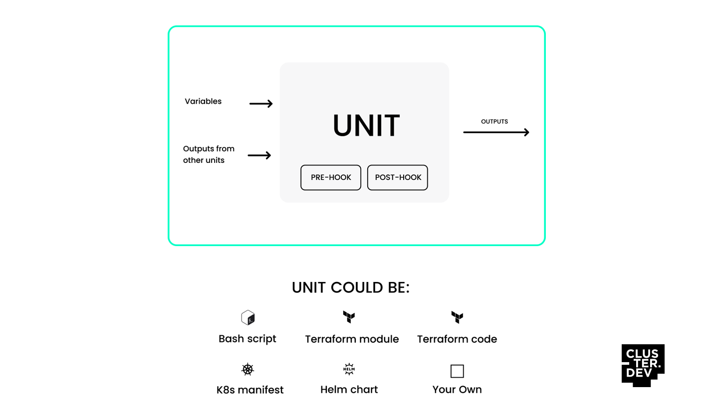

# Cluster.dev - Cloud Infrastructures' Management Tool

Cluster.dev is an open-source tool designed to manage cloud native infrastructures with simple declarative manifests - stack templates. It allows you to describe a whole infrastructure and deploy it with a single tool.

[Stack templates](https://docs.cluster.dev/stack-templates-overview/) could be based on Terraform modules, Kubernetes manifests, Shell scripts, Helm charts and ArgoCD/Flux applications, OPA policies, etc. Cluster.dev sticks those components together so that you could deploy, test and distribute a whole set of components with pinned versions.

## Base concept diagrams

Stack templates are composed of [units](https://docs.cluster.dev/units-overview/) - Lego-like building blocks responsible for passing variables to a particular technology.

Templates define infrastructure patterns or even the whole platform.

## Features

- Based on DevOps and SRE best-practices.
- Simple CI/CD integration.
- GitOps cluster management and application delivery.
- Automated provisioning of Kubernetes clusters in AWS, Azure, DO and GCE.

